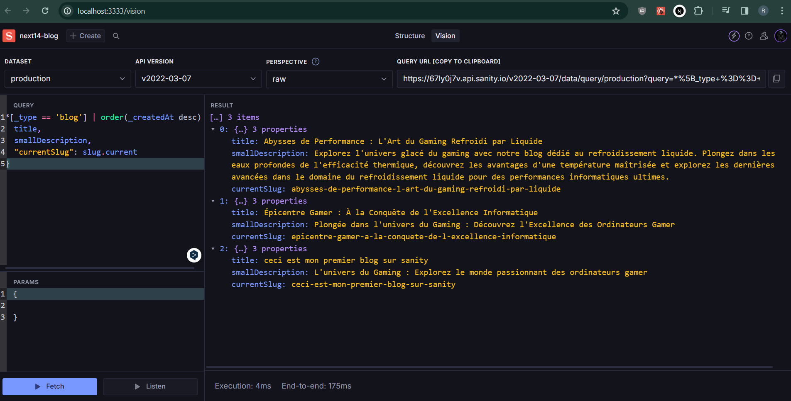
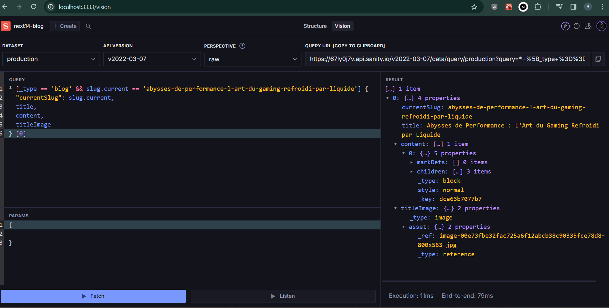

https://www.youtube.com/watch?v=Lydgf-Hvla4

# I. configuration du projet
## 1. installer sanity

```bash
npm create sanity@latest -- --template clean --create-project "next14-blog" --dataset production
```

## 2. configurer un schemas
on creer un fichier sanity\schemas\blog.ts avec
> app\sanity\schemas\blog.ts
```ts

export default {
  name: 'blog',
  type: 'document',
  title: 'Blog',
  fields: [
    {
      name: 'title',
      type: 'string',
      title: 'Titre du blog'
    },
    {
      name: 'slug',
      type: 'slug',
      title: 'slog du blog',
    },
    {
      name: 'titleImage',
      type: 'image',
      title: 'Image du blog',
    }, 
    {
      name: 'smallDescription',
      type: 'text',
      title: 'Pesite description'
    },
    {
      name: 'content',
      type: 'array',
      title: 'Contenu du blog',
      of: [
        {
          type: 'block'
        }
      ]
    }
  ]
}

```

et dans le sanity\schemas\index.ts on importe notre blog schema

> app\sanity\schemas\index.ts
```ts
import blog from "./blog"

export const schemaTypes = [blog]

```

## 3. lancer le sanity studio
```cmd
cd sanity
npm run dev 
```
maintenant on lancer le studio sur : http://localhost:3333/

et on peut creer un blog avec le studio

on creer 3 ou 4 blog sur le studio


## II. la suite

### on cree la navbar

> app\components\Navbar.tsx
```tsx

const Navbar = () => {
  return (
    <div>Navbar</div>
  )
}

export default Navbar
```

et on met notre navbar dans layout


> app\layout.tsx
```tsx
import type { Metadata } from 'next'
import { Inter } from 'next/font/google'
import './globals.css'
import Navbar from '@/app/components/Navbar'

const inter = Inter({ subsets: ['latin'] })

export const metadata: Metadata = {
  title: 'Create Next App',
  description: 'Generated by create next app',
}

export default function RootLayout({
  children,
}: {
  children: React.ReactNode
}) {
  return (
    <html lang="en">
      <body className={inter.className}>
        
        <Navbar />

        <div>
          {children}
        </div>
      </body>
    </html>
  )
}


```

la version finale de la navbar : 

> app\components\Navbar.tsx
``` tsx
import Image from "next/image"
import Link from "next/link"

const Navbar = () => {
  return (
    <nav 
      className="w-full flex items-center justify-between max-w-7xl mx-auto p-5
      bg-gradient-to-b from-gray-900 to-gray-600 
      "
      >
      <Link href={"/"}>
         <div className="flex items-center justify-center">

          <Image src={"/logo4-1.png"} width={150} height={100} alt="logo" />
          <span className="text-gray-300 text-2xl text-bold">
            Blog
          </span>

         </div>
      
      </Link>
      <div>user</div>
    </nav>
  )
}

export default Navbar
```


### installation de schacn ui

```cmd
npx shadcn-ui@latest init
```

### conifgurer le themes avec shadcn ui
on va dans le site de shadcn, on copie le theme

et on le met dans globals.css

> app\globals.css
```css 
@tailwind base;
@tailwind components;
@tailwind utilities;
 

@layer base {
  :root {
    --background: 0 0% 100%;
    --foreground: 20 14.3% 4.1%;
    --card: 0 0% 100%;
    --card-foreground: 20 14.3% 4.1%;
    --popover: 0 0% 100%;
    --popover-foreground: 20 14.3% 4.1%;
    --primary: 24.6 95% 53.1%;
    --primary-foreground: 60 9.1% 97.8%;
    --secondary: 60 4.8% 95.9%;
    --secondary-foreground: 24 9.8% 10%;
    --muted: 60 4.8% 95.9%;
    --muted-foreground: 25 5.3% 44.7%;
    --accent: 60 4.8% 95.9%;
    --accent-foreground: 24 9.8% 10%;
    --destructive: 0 84.2% 60.2%;
    --destructive-foreground: 60 9.1% 97.8%;
    --border: 20 5.9% 90%;
    --input: 20 5.9% 90%;
    --ring: 24.6 95% 53.1%;
    --radius: 0.5rem;
  }

  .dark {
    --background: 20 14.3% 4.1%;
    --foreground: 60 9.1% 97.8%;
    --card: 20 14.3% 4.1%;
    --card-foreground: 60 9.1% 97.8%;
    --popover: 20 14.3% 4.1%;
    --popover-foreground: 60 9.1% 97.8%;
    --primary: 20.5 90.2% 48.2%;
    --primary-foreground: 60 9.1% 97.8%;
    --secondary: 12 6.5% 15.1%;
    --secondary-foreground: 60 9.1% 97.8%;
    --muted: 12 6.5% 15.1%;
    --muted-foreground: 24 5.4% 63.9%;
    --accent: 12 6.5% 15.1%;
    --accent-foreground: 60 9.1% 97.8%;
    --destructive: 0 72.2% 50.6%;
    --destructive-foreground: 60 9.1% 97.8%;
    --border: 12 6.5% 15.1%;
    --input: 12 6.5% 15.1%;
    --ring: 20.5 90.2% 48.2%;
  }
}

 
@layer base {
  * {
    @apply border-border;
  }
  body {
    @apply bg-background text-foreground;
  }
}
```

### installation de dark mode switcher avec shadcn ui

 ##### - installer le next-themes
la doc : https://ui.shadcn.com/docs/dark-mode/next

```cmd
npm install next-themes
```
##### - Create a theme provider

on creer un fichier
> components/theme-provider.tsx
```tsx
"use client"

import * as React from "react"
import { ThemeProvider as NextThemesProvider } from "next-themes"
import { type ThemeProviderProps } from "next-themes/dist/types"

export function ThemeProvider({ children, ...props }: ThemeProviderProps) {
  return <NextThemesProvider {...props}>{children}</NextThemesProvider>
}

```


##### - Wrap your root layout


> app/layout.tsx
```tsx {.typescript .numberLines .lineAnchors highlight=[5,24-29, 37]} 
import type { Metadata } from 'next'
import { Inter } from 'next/font/google'
import './globals.css'
import Navbar from '@/app/components/Navbar'
import { ThemeProvider } from './components/theme-provider'

const inter = Inter({ subsets: ['latin'] })

export const metadata: Metadata = {
  title: 'Create Next App',
  description: 'Generated by create next app',
}

export default function RootLayout({
  children,
}: {
  children: React.ReactNode
}) {
  return (
    <html lang="en">

      <body className={inter.className}>
        
        <ThemeProvider
          attribute="class"
          defaultTheme="system"
          enableSystem
          disableTransitionOnChange
        >

          <Navbar />

          <div>
            {children}
          </div>

        </ThemeProvider>

      </body>

    </html>
  )
}

```


##### - Add a mode toggle

```cmd
npx shadcn-ui@latest add dropdown-menu
npm i @radix-ui/react-icons
```

dans app\components\ModeToggle.tsx

> app\components\ModeToggle.tsx
```tsx
"use client"

import * as React from "react"
import { MoonIcon, SunIcon } from "@radix-ui/react-icons"
import { useTheme } from "next-themes"

import { Button } from "@/components/ui/button"
import {
  DropdownMenu,
  DropdownMenuContent,
  DropdownMenuItem,
  DropdownMenuTrigger,
} from "@/components/ui/dropdown-menu"

export function ModeToggle() {
  const { setTheme } = useTheme()

  return (
    <DropdownMenu>
      <DropdownMenuTrigger asChild>
        <Button variant="outline" size="icon">
          <SunIcon className="h-[1.2rem] w-[1.2rem] rotate-0 scale-100 transition-all dark:-rotate-90 dark:scale-0" />
          <MoonIcon className="absolute h-[1.2rem] w-[1.2rem] rotate-90 scale-0 transition-all dark:rotate-0 dark:scale-100" />
          <span className="sr-only">Toggle theme</span>
        </Button>
      </DropdownMenuTrigger>
      <DropdownMenuContent align="end">
        <DropdownMenuItem onClick={() => setTheme("light")}>
          Light
        </DropdownMenuItem>
        <DropdownMenuItem onClick={() => setTheme("dark")}>
          Dark
        </DropdownMenuItem>
        <DropdownMenuItem onClick={() => setTheme("system")}>
          System
        </DropdownMenuItem>
      </DropdownMenuContent>
    </DropdownMenu>
  )
}

```

##### - et enfin, on le met dans notre navbar comme ceci

> app\components\Navbar.tsx
```tsx
<ModeToggle />
```

## III. fetch data avec sanity 

doc : cheat sheet pour query : https://www.sanity.io/docs/query-cheat-sheet

- vision pour essayer notre requette 
on peut preparer notre requette comme ceci


- on a le query suivant pour afficher la liste des posts dans un ordre decroissant 👍
```ts
*[_type == 'blog'] | order(_createdAt desc) {
  title, 
  smallDescription,
  "currentSlug": slug.current
}
```


### - on cree un sanity client dans lib\sanity.ts

installation avec la commande ci-dessous
```cmd
npm i next-sanity
```
et creer le fichier 👍
> lib\sanity.ts
```ts
import { createClient } from "next-sanity"

export const client = createClient({
  apiVersion: "2023-05-03",
  dataset: process.env.SANITY_DATASET,
  projectId: process.env.SANITY_PROJECT_ID,
  useCdn: false
})

```

creer un .env

> .env
```
SANITY_PROJECT_ID="......"
SANITY_DATASET="......"

```
### ensuite, on type les datas

dans lib\interface.ts

> lib\interface.ts
```ts
export interface simpleBlogCard {
  title: string
  smallDescription: string
  currentSlug: string,
  titleImage: string
}
```

et dans page.tsx
> app\page.tsx
```
import { simpleBlogCard } from "@/lib/interface";

.....
.....
const data: simpleBlogCard[] = await client.fetch(query)

```


### et on affiche les données sur la page

mais d'abord, on va installer d'abord le card de shadcn 

```cmd
npx shadcn-ui@latest add card
```

pour afficher l'image sanity a besoin de transformer l'objet de image en url, donc il faut installer 
```cmd
npm install --save @sanity/image-url
```

dans sanity lib\sanity.ts on va creer une fonction pour transformer l'objet image en url

> lib\sanity.ts
```ts
import { createClient } from "next-sanity"
...
...
const builder = imageUrlBuilder(client)

export function urlFor(source: any) {

  return builder.image(source)
}

```


et notre page.tsx resemble à ceci 
> app\page.tsx
``` tsx

import { Button } from "@/components/ui/button";
import { Card, CardContent, CardHeader } from "@/components/ui/card";
import { simpleBlogCard } from "@/lib/interface";
import { client, urlFor } from "@/lib/sanity";
import Image from "next/image";
import Link from "next/link";

async function getData() {

  const query = `
  
  *[_type == 'blog'] | order(_createdAt desc) {
    title, 
    smallDescription,
    "currentSlug": slug.current,
    titleImage
  }
  
  `
  const data: simpleBlogCard[] = await client.fetch(query)

  return data

}

export default async function Home() {

  const data = await getData()

  console.log("les données", data)

  return (
    <main className="">
      
      <div className="grid grid-cols-1 sm:grid-cols-2 md:grid-cols-3 lg:grid-cols-4 gap-2">
        { data && data.map((post, index) => (
          
          <Card key={index}>

            <CardContent className="p-5">


              <Image 
                src={urlFor(post.titleImage).url()} 
                alt={post.title} 
                width={300} 
                height={300} 
                className="w-full h-full object-cover"  
              />


              <h3 className="text-lg line-clamp-2 my-5 text-gray-100 font-bold">{post.title}</h3>
              <p className="text-sm line-clamp-3 mb-5 text-gray-400">{post.smallDescription}</p>

              <Button asChild className="w-full ">
                <Link href={`/blog/${post.currentSlug}`}>Lire la suite</Link>
              </Button>

            </CardContent>
            
          </Card>
          
        ))}
      </div>
    </main>
  )
}


```


et enfin, puisqu'on utilise le <Image />, il faut ajouter dans le next.config.js le domaine de l'image

> next.config.js
```ts
const nextConfig = {
  images: {
    remotePatterns: [
      {
        protocol: 'https',
        hostname: 'cdn.sanity.io',
        // port: '',
        // pathname: '/account123/**',
      },
    ],
  },
}
```


## IV. afficher le blog par slug - dynamique route

###  1. on cree le fichier blog/[slug]/page.tsx

>app\blog\[slug]\page.tsx
```tsx

const BlogDetails = () => {
  return (
    <div>BlogDetails</div>
  )
}

export default BlogDetails

```

et on verifie si ca marche avec le slug : http://localhost:3000/blog/abysses-de-performance-l-art-du-gaming-refroidi-par-liquide

et oui, on affiche bien le mot BlogDetails sur la page.

### 2. comment afficher le slug avec params

on desctructure le params et on affiche le slug

> app\blog\[slug]\page.tsx
```tsx
const BlogDetails = ({params}: {params: {slug: string}}) => {
  return (
    <div>
      <h1>le slug est = {params.slug}</h1>
    </div>
  )
}
```

### 3. fetch du data avec le slug - @portabletext/react pour sanitizer le contenu

- on va dans sanity studio pour simuler la requette



- on ajoute une interface pour notre data

> lib\sanity.ts
``` ts
export interface fullBlog {
  currentSlug: string
  title: string
  smallDescription: string
  content: any
  titleImage: any
}
```

- on query la data, et on console log pour verifier si ca

> app\blog\[slug]\page.tsx
``` tsx
import { fullBlog } from "@/lib/interface"
import { client } from "@/lib/sanity"

async function getData(slug: string) {

  const query = `

    * [_type == 'blog' && slug.current == '${slug}'] {
        smallDescription,
        "currentSlug": slug.current,
        title,
        content,
        titleImage
      } [0]

  `
  const data: fullBlog = await client.fetch(query)
  
  return data

}

const BlogDetails = async ({params}: {params: {slug: string}}) => {

  const data = await getData(params.slug)

  console.log("les données par slug", data)

  
  return (
    <div>
      <h1>le slug est = {params.slug}</h1>
    </div>
  )
}

export default BlogDetails
```

- ensuite pour afficher le content, c'est encore toute une histoire, il faut installer un package
- 
``` cmd
  npm i @portabletext/react
```

parce qu'il faut sanitiser le content à afficher (parce que c'est un objet bizare de sanity)

- pour afficher le content, on va dans le blog/[slug]/page.tsx

``` tsx
import PortableText from "@portabletext/react"
...
...

// et

<PortableText value={data.content} />
...
...

```


### 4. afficher les markdown - avec la librairies @tailwindcss/typography - pour bien afficher les typo du contenu
doc: https://tailwindcss.com/docs/typography-plugin


installation:
``` cmd
npm install -D @tailwindcss/typography
```
et Then add the plugin to your tailwind.config.js file:

> tailwind.config.js
```ts
/** @type {import('tailwindcss').Config} */
module.exports = {
  theme: {
    // ...
  },
  plugins: [
    require('@tailwindcss/typography'),
    // ...
  ],
}

```

et dans le contenu, on ajoute la classe tailwind css prose lg:prose-xl comme ceci 👍

> app\blog\[slug]\page.tsx
```tsx
  ...
  ...

  <div className="mt-8 ">
    <PortableText value={data?.content} />
  </div>
  ...
  ...

```


